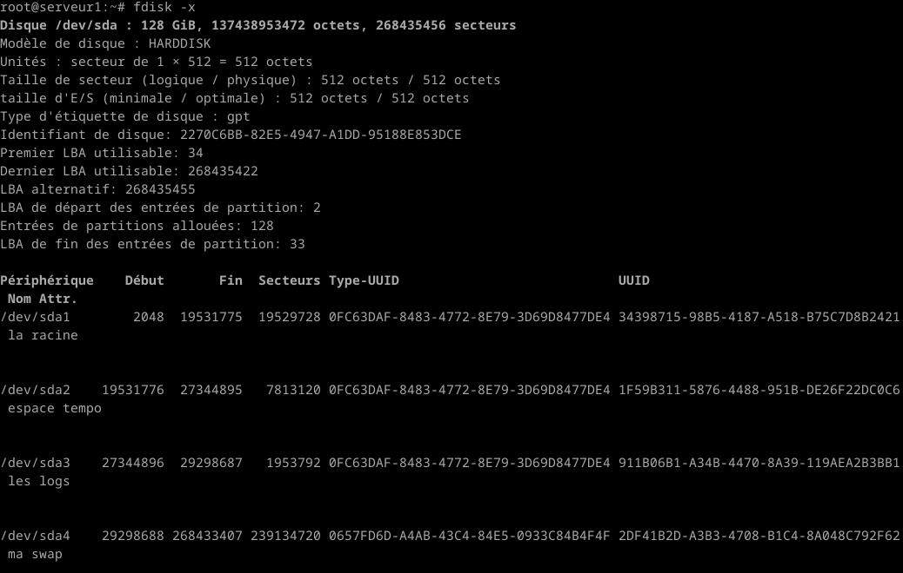

# UNIX

## TP n°1: Installation Serveurs

### Instalation Machine virtuelle

#### 1.2 Récupération Installeur

Pour récupérer l'iso demandé, il faut:
- Rentrer cette [URL](ftp.lip6.fr/pub/linux/distributions/debian/) dans un navigateur web.
- Suivre le chemin suivant : /dists/release/main/installer-arch/current/images/netboot/. En remplaçant "release" par "bookworm/" (actuelle version stable). Et en remplaçant "installer-arch" par "installer-amd64/".
- Télécharger mini.iso.

#### 1.3 Lancement de la machine virtuelle

Depuis le terminale lancer Vbox avec la commande "Vbox LicencePro2023, saisir son code de session. Une erreur apparait, il suffit de choisir le fichier iso qu'on a téléchargé dans l'onglet DVD.

#### 1.4 Installation

Suivre chaque étape de l'instalation fournis dans le TP. J'ai fais une première erreur concernant le proxy, j'ai oublié de le mettre, donc j'ai du recommencé l'instalation. La deuxième fois (problème install base system -> ctrl + alt + F4), j'ai mal rentré le proxy. La troisième fu la bonne : http://proxy.ufr-info-p6.jussieu.fr:3128


### 2 Post-Installation

#### 2.1 Configuration ssh

Rentrer la commande
``` apt install ssh ``` 
Pour vérifié que ssh est installé 
``` dpkg -l ssh ```
Pour vérifié qu'ssh fonctionne : 
- On essai de se connnecter en ssh depuis notre machine
- ``` systemctl status ssh ```
- ``` ps aux | grep ssh ```
Il faut maintenant modifier le fichier "sshd_config":
```
cd /etc/ssh
ls
nano sshd_config
```
Chercher la ligne "#PermitRootLogin prohibit-password" et écrire en dessous "PermitRootLogin yes"
Relancer le serveur ssh : 
``` systemctl restart ssh ```

#### 2.2 Connexion

Il faut maintenant récupérer l'IP du serveur avec la commande 
``` ip a ``` 
Dans un nouveau terminal de la machine linux : 
- ``` ping 10.20.0.30 ``` pour voir si ont arrive à communiquer avec la VM.
- ``` ssh root@10.20.0.30 ``` pour ce connecter en ssh.

#### 2.3 Nombre de paquets


#### 2.4 Space Usage


On peux voir grâce à la ligne /dev/sda1 que le fichier racine utilise 1.6 Go.

#### 2.5 Expliquer les commandes et le résultat obtenu

- ``` echo $LANG ```
  retourne les information de la langue utilisée :  "fr_FR.UTF.8".
  
- 
  ``` hostname  ```
 retourne le nom de la VM.

- ``` man hostname ```
  
  Pour afficher le domaine, il suffie de mettre la commande
  ``` hostname -d ```
  
  
- ``` cat /etc/apt/sources.list | grep -v -E '^#|^$' ```
  on affiche les lignes qui ne commence pas par # ou $ du fichier sources.list
  
  
- 
  
- 
Affiche uniquement l'utilisateur qui n'a pas besoin de rentrer son mot de passe.
- 
Liste les tables de partitions des périphériques spécifiés.

Plus d'informations.

- ``` df -h ```
  permet d'afficher de manière compréhensive (en Mo, Go...) l'utilisation de l'espace disque du système fichier.


### 3 Aller plus loin

#### 3.1 Installation automatique 

``` pressed ``` 
sert à installer plus rapidement la machine virtuelle. Fichier texte que l'on charge en même temps que le fichier iso qui permet de répondre à toutes les questions auquelles on a répondu pour insataller et configurer la machine virtuelle.

#### 3.2 Rescue mode 

Pour pouvoir changer le mot de passe de Root si on l'a perdu, il suffit de rentrer la commande ```passwd root ```. 
On peut rentrer un nouveau mot de passe.


#### 3.3 Redimentionnement partition

Je n'ai pas réussie à trouver comment redimmensionner ma partition racine sans la désinstaller et réinstaller.
J'ai vu qu'on devait utiliser fdisk -l et gparted, mais je n'ai pas trouvé plus d'information.
