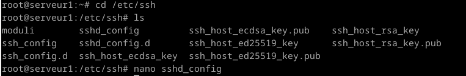
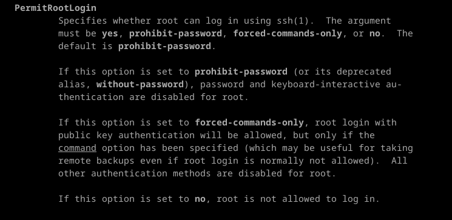
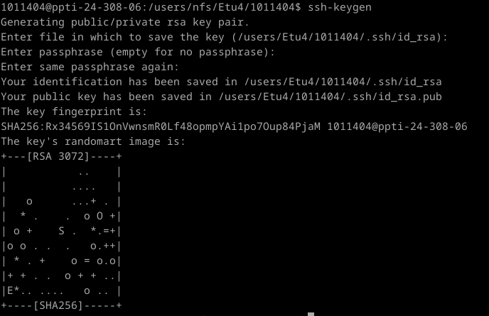
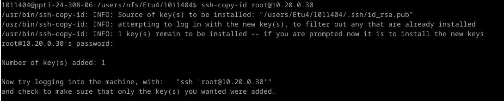
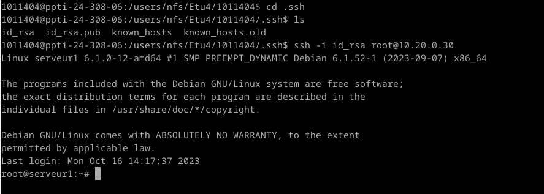
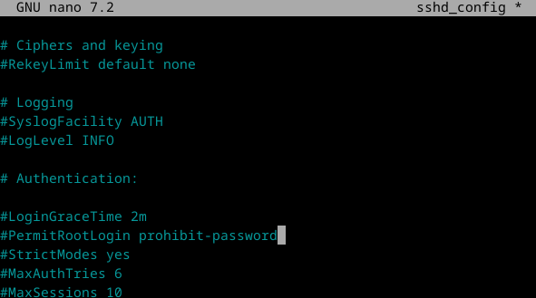
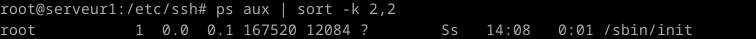
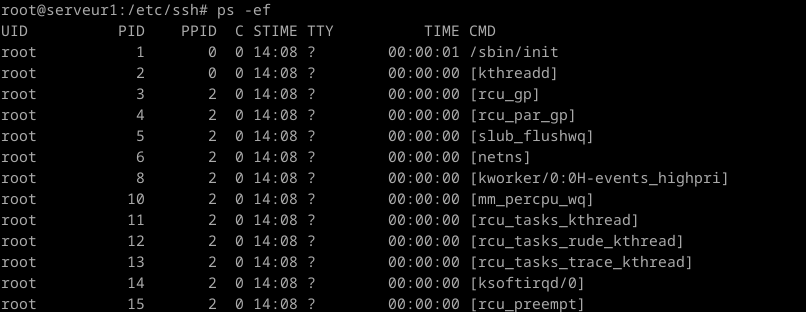
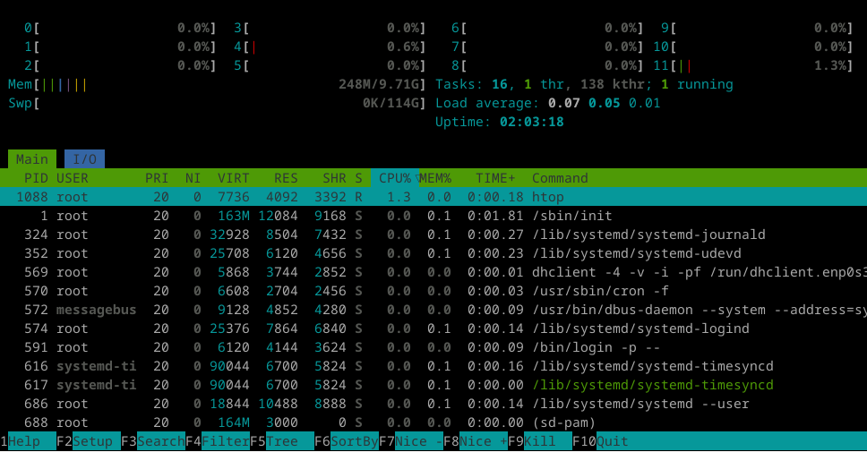

# UNIX

## TP n°2: Secure Shell : SSH

### 1 Secure Shell : SSH

#### 1.1 Connection ssh root (reprise fin tp-01)

Pour ce connecter en ssh, lancer la VM avec la commande ``` Vbox LicencePro2023 ```  
Pour modifier sshd_config  
  
La configuration nécessaire pour permettre les connexions root distante avec mot de passe : trouver la ligne "#PermitRootLogin prohibit-password" et rajouter une ligne en dessous avec "PermitRootLogin yes".  
  
Il existe plusieurs options concernant le PermitRootLogin :  
- yes, premet la connexion à root par mot de passe.
- prohibit-password (c'est l'option par défaut), l'authentification par mot de passe est désactivée pour root.
- forced-commands-only, connexion possible par clé publique uniquement si spécifiée. Toutes les autres méthodes d'authentification sont désactivées pour root.
- no, root n'est pas autorisé à se connecter.  
Relancer ssh ``` systemctl restart ssh ```  
Maintenant que la VM fonctionne, on se connecte ``` ssh root@10.20.0.30 ```  


#### 1.2 Authentification par clef / Génération de clefs et 1.3 Authentification par clef / Connexion serveur

Pour créer le couple de clef d'authentifiaction privé/publique ``` ssh-keygen ```  
  

Copie de la clé publique sur le serveur.  
  
Mettre une passphrase et necessaire, voir obligatoire. C'est une sécurité suplémentaire, pour ce connecter il faut la clé et la passphrase.  
Donc du temps suplémentaire pour devoir trouver les accès au serveur.  

Restriction du fichier authorized-keys, droit de lecture, écriture et execution pour le propriétaire seulement.  
  


#### 1.4 Authentification par clef : depuis la machine hôte

Pour pouvoir se connecter en utilisant la clef : ``` ssh -i id_rsa root@10.20.0.30 ```  
  


#### 1.5 Sécurisez 

On rechange le fichier sshd_config afin d'enlever la possibilité de se connecter avec le mot de passe root et on grade uniquement la connexion par clé.  
On retourne donc dans le fichier avec nano et on supprime la ligne rajouté dans le 1.1, on revient donc au fichier initiale.  
  
On relance ssh ``` systemctl restart ssh ```  

Les attaques dites « bruteforce SSH » sont des tentatives de connexions SSH effectuant une succession d'essais pour découvrir un couple utilisateur/mot de passe valide afin de prendre le contrôle de la machine. Il s'agit d'une attaque très répandue et toute machine exposée sur Internet se verra attaquer plusieurs fois par jour.

Quelques solutions : 
| Solutions | Avantages | nconvénients |
| :----------------------------- | :----------------------------- |:----------------------------- |
| N'autoriser que l'authentification par clé ssh. | Aucune connexion avec mot de passe root n'est demander, il faut avoir la clé. | Ne protège pas complètement le service. Certains robots peu intelligents continueront de tenter un très grand nombre de connexions, ce qui peut induire certains effets indésirables, comme une forte charge du service et le remplissage des journaux. |
| Limiter le nombre de tentative de connexion par IP. | Permet d'empêcher le robot de faire plus de x tentative par IP. | Le robot peut changer d'IP et continuer. De plus si un utilisateur se trompe de mot de passe x fois, il peux être bloqué. |
| Faire une liste blanche. | Permet d’autoriser uniquement certains IPs à se connecter. (Si l’ip du pirate n’est pas présent dans la liste la connexion lui sera refusé) | Notifier toutes les ip autorisé, ce qui peut être embêtant si notre utilisateur autorisé change de réseau constamment. |  


### 2 Processus

#### 2.1 Etude des processus UNIX

1.  
  
Time : Temps total d'utilisation du processeur accumulé pour un processus particulier.  
  
  
  
  
Il y a eu approximativement 700 processus depuis le démarage ``` ps -ef ```  

2. 
  
Le processus  avec le ppid est le 703 donc pour voir l'ancêtre :  
  

3. 
  
Renvoie qu'il faut installer psmisc.  
  
``` pstree ```  

4. 
  
La liste des processus triée par occupation mémoire décroissante :  
  
Le processus le plus gourmand : le 1009  
  
Mettre en couleur :  
  
Changer de colonne de trie :  
  
htop : il facilite la compréhension des données grâce à son interface interactive pour trier les résultats, mais il consomme plus de ressources.  
  


### 3 Arrêt d'un proucessus

Ecriture des script :  
  
  
Mise en arrière plan :  
  
Arrêt des horloges :  
  
Fichier « date.sh » :  
#!/bin/sh => Signifie qu’il est recommander d’exécuter le script avec la commande « sh ».  
while true; => Signifie une boucle infinie.  
do => Début de la boucle.  
sleep 1; => Met le processus en pause pendant 1 seconde.  
echo -n ’date ’; => Affiche « date » sans le retour à la ligne (-n).  
date +%T; => Affiche la date et l’heure actuelle au format heure uniquement (+%T).  
done => Fin de la boucle.  

Fichier « date-toto.sh » :  
Reprendre les explications du fichier « date.sh ».  
--date ’5 hour ago’ => Précise la date de départ qui est la date actuelle moins 5 heures.  


### 4 Les tubes

  
  
``` ls | cat ``` La commande permet de lister de manière structurer les fichiers (avec retour à la ligne) présent dans le répertoire.  
``` ls -l | cat > liste ``` La commande permet de créer le fichier « liste » et d’enregistrer le résultat de la commande « ls -l » dedans.  
``` ls -l | tee liste  ``` La commande fait la même chose que la commande précédente sauf qu’elle affiche le résultat aussi.  
```  ls -l | tee liste | wc -l ``` La commande fait la même chose que la commande précédente mais au lieu d’afficher le résultat du fichier, elle affiche le nombre de ligne occupé dans le fichier.  


### 5  Journal système rsyslog

``` systemctl status rsyslog ```  rsyslog n'est pas reconnue.  
``` /var/log ```  et ``` /var/spool/rsyslog  ```   
Cron est un programme pour exécuter automatiquement des scripts, des commandes ou des logiciels à une date et une heure spécifiée précise, ou selon un cycle défini à l’avance Chaque utilisateur a un fichier crontab, lui permettant d'indiquer les actions à exécuter. Cron est parfois appelé "planificateur de tâches" ou "gestionnaire de tâches planifiées".  
tail permet d’afficher la fin d’un fichier en temps réel.  
Le fichier "/etc/logrotate.conf" permet de configurer la rotation des logs, c’est-à-dire si les logs les plus anciens doivent être archivé ou supprimé.  


Différentes sources :  
(https://blog.garamotte.net/posts/2018/01/07/fr-limit-brute-force-attacks-on-the-ssh-service.html)  
(https://www.it-connect.fr/chapitres/authentification-ssh-par-cles/?utm_content=cmp-true)  
(https://www.digitalocean.com/community/tutorials/how-to-use-ssh-to-connect-to-a-remote-server-fr)  
(https://www.hostinger.fr/tutoriels/gerer-processus-linux-ligne-commande#:~:text=La%20commande%20top%20est%20utilis%C3%A9e,plac%C3%A9%20en%20t%C3%AAte%20de%20liste.)  
(https://www.malekal.com/commande-jobs-fg-et-bg-sur-linux-utilisations-et-exemples/)  
(https://www.it-connect.fr/chapitres/authentification-ssh-par-cles/?utm_content=cmp-true)  