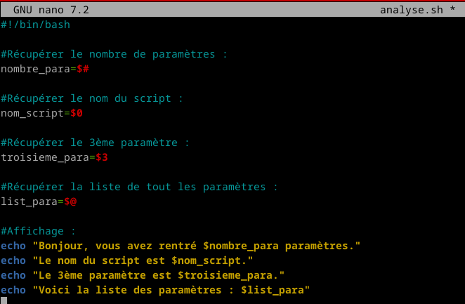
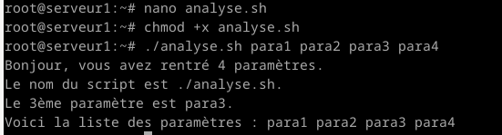
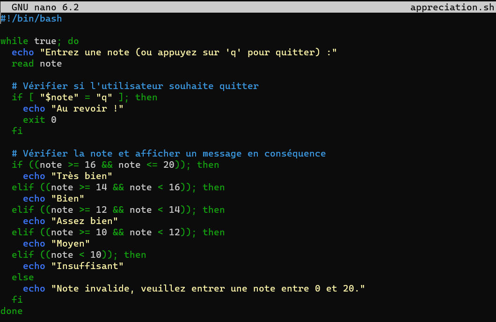
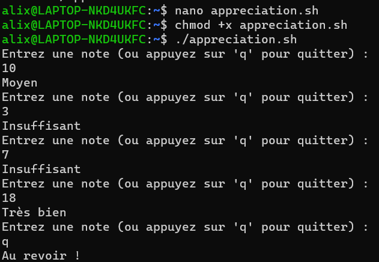

# UNIX

## TP n°3: Shell bash

### Paramètre

Script :  
  
Résultat :  
  


### Vérification du nombre de paramètres

Script (je l'avais mal nommé "contact.sh" au lieu de "concat.sh") :  
  
Résultat :  
  


### Argument type et droits

Script :  
  
§[Script Suite](./asset/arg%20type%20et%20droits/nano.png)  
Résultat :  
  


### Afficher le contenu d’un répertoire

Script :  
  
Résultat :  
  


*A partir de l'exercie suivant le tp à été réalisé sur mon pc perso. J'utilise Ubuntu.*  


### Lister les utilisateurs  

``` bash
#!/bin/bash
for user in $(cat /etc/passwd); 
do echo $user; 
done 
```   
Ce script affiche le fichier passwd ligne par ligne, or on veut afficher que le login des utilisateurs qui ont un UID supérieur à  100.  
On va donc utiliser cut pour avoir uniquement les clonnes qui nous intérressent.  
Script :  
  
Résultat :  
  
Script avec awk :  
  
Résultat avec awk:  
  


###  Mon utilisateur existe t’il  

Script :  
  
  
Résultat :  
  ''


### Creation utilisateur  

Script :  
  
  
Résultat :  
  
  


###  Lecture au clavier

1. Essayer les commandes suivantes :  
``` bash
echo -n "Entrer votre nom: "
read nom
echo "Votre nom est $nom"
```  
  
2. Teste file et more :  
  
- **Comment quitter more ?** Pour quitter more, on appuie sur "q".  
- **Comment avancer d’une ligne ?** Pour avancer d'une ligne, on appuie sur la touche "entrer" ou sur la flèche vers le bas.  
- **Comment avancer d’une page ?** Pour avancer d'une page, on appuie sur la touche "espace".  
- **Comment remonter d’une page ?** Pour remonter d'une page, on appuie sur la touche "b".  
- **Comment chercher une chaîne de caractères ? Passer à l’occurence suivante ?** Pour rechercher une chaîne de caractères, on appuie sur "/". Cela permet de saisir la chaîne que l'on souhaite rechercher, puis on appuie sur "Entrée". Pour passer à l'occurrence suivante, on appuie sur "n".  
3. Script :  
  
Résultat :  
  


### Appréciation

Script :  
  
Résultat :  
  
